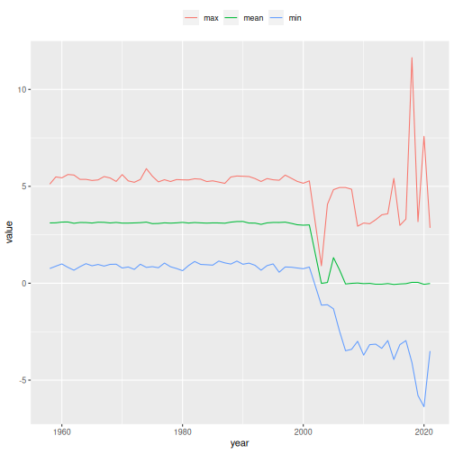

## The Apache Arrow framework

The definition of the Apache Arrow framework is best described from
their website:

> Apache Arrow is a software development platform for building high
performance applications that process and transport large data sets. It
is designed to both improve the performance of analytical algorithms and
the efficiency of moving data from one system or programming language to
another.

> A critical component of Apache Arrow is its in-memory columnar format, a
standardized, language-agnostic specification for representing
structured, table-like datasets in-memory. This data format has a rich
data type system (included nested and user-defined data types) designed
to support the needs of analytic database systems, data frame libraries,
and more.

In other words, the Apache Arrow framework was designed to deal with
large datsets (larger than memory), using in-memory analytics. This
means that the computations made with "Arrow datasets" are extremaly
efficient, resulting in very fast computations, otherwise infeasible
with standard computations.

The Apache Arrow framework can be used in many different programming
languages. However, in each of this languages, there are specific
libraries to deal with it. In R, the [arrow][] package is available to
load and manipulate Arrow datasets. The manipulation of Arrow objects
are made through [dplyr][] verbs, which helps users to feel familiar
with it. Not all **dplyr** verbs are availbale to work with Arrow
datasets, but the vast majority of the most used ones are already
"translated" to be used with Arrow. A list of such functions can be
found in [Functions available in Arrow dplyr queries][]. A general
introduction of using **dplyr** verbs with Arrow can be seen in [Data
analysis with dplyr syntax][].

## Using Apache Arrow with geslaR

The **geslaR** package makes use of the [Apache Arrow][] framework to deal
with the [GESLA][] dataset in R.

In this tutorial, we will use the `download_gesla()` function, to
download the full GESLA dataset, and show some basic data manipulation
with the **arrow** package and **dplyr** verbs.

The first time you load the **geslaR** package, it will automatically
load both the **arrow** and **dplyr** packages.


```r
library(geslaR)
#> Loading required package: arrow
#> 
#> Attaching package: 'arrow'
#> The following object is masked from 'package:utils':
#> 
#>     timestamp
#> Loading required package: dplyr
#> 
#> Attaching package: 'dplyr'
#> The following objects are masked from 'package:stats':
#> 
#>     filter, lag
#> The following objects are masked from 'package:base':
#> 
#>     intersect, setdiff, setequal, union
```

To download the full GESLA dataset, one can simply use


```r
download_gesla()
```

This will create a directory called `gesla_dataset` in the current
working directory (as defined by `getwd()`) and download the full
dataset locally. This download may take some time, as it depends on
internet connection, but it's necessary only once. Note that this full
dataset will need at least 7GB of (hard drive) storage, so make sure
this is feasible. However, once downloaded, you will have access to the
full dataset, and you will only need to do this once.

You will notice that the full dataset is composed by 5119 [Apache
Parquet][] files, ending in `.parquet`


```r
## Number of downloaded files
length(list.files("gesla_dataset"))
#> [1] 61
## Check the first files
head(list.files("gesla_dataset"))
#> [1] "aranmore_island_leabgarrow-ara-irl-mi_c.parquet"
#> [2] "aranmore-ara-irl-cmems.parquet"                 
#> [3] "arklow_harbour_opw_station-ark-irl-mi_c.parquet"
#> [4] "arklowharbour-ark-irl-cmems.parquet"            
#> [5] "ballycotton_harbour-bal-irl-mi_c.parquet"       
#> [6] "ballycotton-bal-irl-cmems.parquet"
```

These files are the same originally distributed in the GESLA dataset, so
that each one refers to a site from where the data comes from. To load
this full dataset in R, use the `arrow::open_dataset()` function,
specifying the location of the `.parquet` files. Altough there are many
files, this function recognizes them as a single dataset, because they
all have the same structure (or "Schema").


```r
## Open dataset
da <- open_dataset("gesla_dataset")
## Check the object
da
#> FileSystemDataset with 61 Parquet files
#> date_time: timestamp[us]
#> year: int64
#> month: int64
#> day: int64
#> hour: int64
#> country: string
#> site_name: string
#> lat: double
#> lon: double
#> sea_level: double
#> qc_flag: int64
#> use_flag: int64
#> file_name: string
#> 
#> See $metadata for additional Schema metadata
## Verify class
class(da)
#> [1] "FileSystemDataset" "Dataset"           "ArrowObject"      
#> [4] "R6"
```

Since this is an `ArrowObject` object, it will actually not load
the full dataset in memory (as it would if it was a standard R object,
such as a `tibble` or `data.frame`). Note that some basic informations,
such as `dim()` and `names()` can be retrieved simply with


```r
dim(da)
#> [1] 18189361       13
names(da)
#>  [1] "date_time" "year"      "month"     "day"       "hour"      "country"  
#>  [7] "site_name" "lat"       "lon"       "sea_level" "qc_flag"   "use_flag" 
#> [13] "file_name"
```

However, any other manipulation of the dataset must be made using
**dplyr** verbs. For example, to count the number of observations by
country, one could use


```r
da |>
    count(country)
#> FileSystemDataset (query)
#> country: string
#> n: int64
#> 
#> See $.data for the source Arrow object
```

Note, however, that the output is just a query to the full dataset. To
explicitly return the calculation, you should use `dplyr::collect()`, so
the result is a standard `tibble`


```r
da |>
    count(country) |>
    collect()
#> # A tibble: 3 × 2
#>   country        n
#>   <chr>      <int>
#> 1 IRL     16975901
#> 2 FRA       128934
#> 3 ATA      1084526
```

This is intentionally done so that you can manipulate, calculate, and
extract informations from the dataset, taking advantage of the Arrow
in-memory analytics framework. This way, the computations should be
faster, and the idea is that you just use `dplyr::collect()` when the
final result should be needed as an R object. For example, we could
calculate the mean sea level for Ireland per year, for the whole
dataset, as


```r
da |>
    filter(country == "IRL", use_flag == 1) |>
    group_by(year) |>
    summarise(mean = mean(sea_level)) |>
    arrange(year) |>
    collect()
#> # A tibble: 63 × 2
#>     year  mean
#>    <int> <dbl>
#>  1  1958  3.11
#>  2  1959  3.12
#>  3  1960  3.16
#>  4  1961  3.16
#>  5  1962  3.09
#>  6  1963  3.13
#>  7  1964  3.13
#>  8  1965  3.11
#>  9  1966  3.15
#> 10  1967  3.14
#> # ℹ 53 more rows
```

Any other queries could be made, as long as the **dplyr** verbs uesd are
supported by the **arrow** package. For example, we could ask for the
minimum, mean, and maximum sea level values for Ireland per year


```r
da |>
    filter(country == "IRL", use_flag == 1) |>
    group_by(year) |>
    summarise(
        min = min(sea_level),
        mean = mean(sea_level),
        max = max(sea_level)) |>
    collect()
#> # A tibble: 63 × 4
#>     year   min     mean   max
#>    <int> <dbl>    <dbl> <dbl>
#>  1  2018 -4.09  0.0462  11.6 
#>  2  2019 -5.80  0.0436   3.18
#>  3  2004 -1.11  0.0391   4.07
#>  4  2005 -1.32  1.32     4.83
#>  5  2006 -2.47  0.692    4.94
#>  6  2007 -3.48 -0.0374   4.94
#>  7  2008 -3.41 -0.00481  4.85
#>  8  2014 -2.96 -0.0175   3.59
#>  9  2015 -3.93 -0.0613   5.41
#> 10  2016 -3.17 -0.0370   2.99
#> # ℹ 53 more rows
```

This same query could already be used to produce graphics with
**ggplot2**, for example. In this case, note that tha call to
`dplyr::collect()` is mandatory in advance to using **ggplot2**
functions, as it will only accept standard R objects (such as `tibble`
or `data.frame`).


```r
library(ggplot2)
da |>
    filter(country == "IRL", use_flag == 1) |>
    group_by(year) |>
    summarise(
        min = min(sea_level),
        mean = mean(sea_level),
        max = max(sea_level)) |>
    collect() |>
    tidyr::pivot_longer(cols = c(min, mean, max)) |>
    ggplot(aes(x = year, y = value, colour = name)) +
    geom_line() +
    theme(legend.position = "top") +
    labs(colour = "")
```



[dplyr]: https://dplyr.tidyverse.org/index.html
[arrow]: https://arrow.apache.org/docs/r/index.html
[GESLA]: https://gesla787883612.wordpress.com
[Apache Arrow]: https://arrow.apache.org
[Apache Parquet]: https://parquet.apache.org
[Functions available in Arrow dplyr queries]: https://arrow.apache.org/docs/r/reference/acero.html
[Data analysis with dplyr syntax]: https://arrow.apache.org/docs/r/articles/data_wrangling.html
